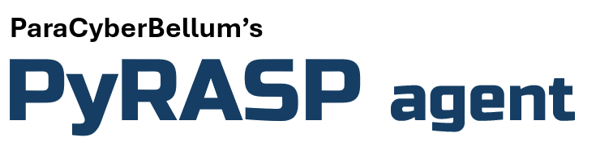

    
    
    

# The Zero-Trust Agent for PyRASP

> The agent is a browser plugin currently available only for Chromium-based browsers.

## Installation
1. Download unpacked version from [https://github.com/rbidou/pyrasp-agent](https://github.com/rbidou/pyrasp-agent)
2. Go to the `chrome://extensions` or `edge://extensions` page
3. Enable **Developper mode**
4. Click **Load unpacked** button
5. Select the directory where the unpacked agent was downloaded
6. Agent is installed

## Configuration
To configure the agent:
1. Click on the agent icon, greyed until configuration is set
2. Enter the header name, application hostname (and port if non-standard) or URL, and the secret key
3. Click the **Update ZTAA Settings** button
4. Agent icon turns to blue

# PyRASP Documentation
[Full documentation](https://paracyberbellum.gitbook.io/pyrasp)
 [Release Notes](https://github.com/rbidou/pyrasp/blob/main/RELEASE-NOTES.md)
 [Web Site](https://pyrasp.paracyberbellum.io)

# Contacts
Renaud Bidou - renaud@paracyberbellum.io